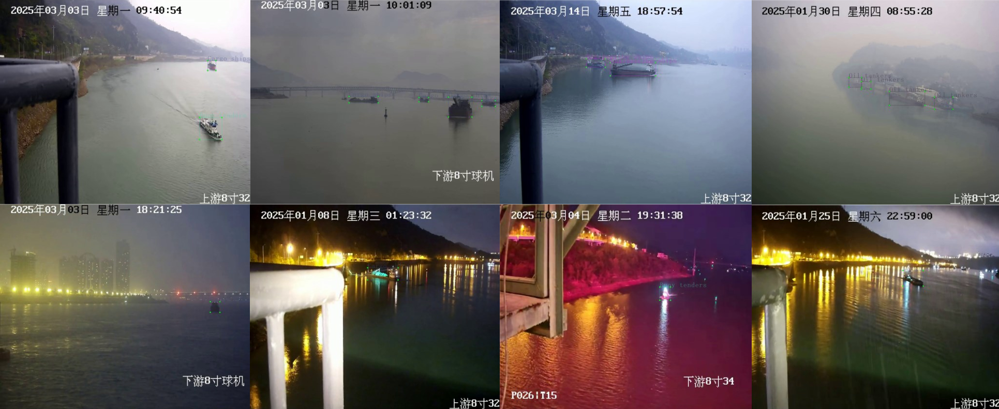

# AIR-Ship: A Real-Time Anti-Interference Framework for Vision-Based Ship Detection in Dense Fog Environments


## 🚢 Introduction
AIR-Ship is a lightweight and robust object detection framework designed for real-time ship detection in inland waterway environments under low-visibility conditions such as dense fog, backlight, and water surface reflections. The framework integrates:
- **Water Surface Image Dehazing (WSID)**: A novel image preprocessing module that enhances clarity in degraded images.
- **YOLOv10 with DS-SPPF**: An optimized detection backbone that incorporates the **Dilated Shared Spatial Pyramid Pooling Fast (DS-SPPF)** module for multi-scale feature extraction and robust detection.

This repository provides the source code, pre-trained models, and the **Inland Waterway Ship Dataset (IWSD)**, which includes 9,305 images captured under diverse weather and lighting conditions.

---

## 📜 Features
1. **Real-time Detection**:
   - Achieves **548 FPS** on standard hardware configurations.
   - Lightweight design with only **2.8M parameters**.
   
2. **Robustness in Low-Visibility Conditions**:
   - Enhanced detection accuracy through the WSID module.
   - Adaptive multi-scale feature fusion using DS-SPPF.

3. **Comprehensive Evaluation**:
   - Validated on **COCO**, **SeaShip**, and the newly constructed **IWSD** datasets.

---

## 📊 Dataset
### Inland Waterway Ship Dataset (IWSD)

In the figure above, (a) and (b) depict comparisons of computational and parameter counts among the models on the COCO 2017 dataset, respectively.

- **Description**: A high-quality dataset consisting of 9,305 images captured from real-world inland waterways (e.g., Yangtze River, Wulong River in China).
- **Categories**: Includes nine common ship types (e.g., cargo ships, fishing boats, ferries, recreational boats).
- **Environmental Diversity**: Images captured under clear, foggy, rainy, and nighttime conditions.
- **Format**: COCO-style annotations.

---

## 🛠️ Installation
Follow the steps below to set up the AIR-Ship framework:

1. Clone this repository:
   ```bash
   git clone https://github.com/Object-Detection-01/YOLO-DC.git
   cd YOLO-DC
   ```

2. Create a virtual environment and install dependencies:
   ```bash
   conda create -n airship python=3.9 -y
   conda activate airship
   pip install -r requirements.txt
   ```

3. Set up PyTorch (ensure your CUDA version matches your system):
   ```bash
   pip install torch torchvision torchaudio
   ```


## 📈 Results
### Performance on COCO Dataset
| Method            | Size | APval | APval50 | APs  | APm  | APl  | FPS | Params | FLOPs  |
|--------------------|------|-------|---------|------|------|------|-----|--------|--------|
| EfficientDet  | 512  | 34.3  | 54.2    | 12.0 | 37.3 | 50.2 | 95  | 3.9M   | 2.5G   |
| RetinaNet-50  | 800  | 35.7  | 55.0    | 18.9 | 38.9 | 46.3 | 14  | 29M    | 165G   |
| Faster R-CNN   | 800  | 27.2  | 48.4    | 6.6  | 28.6 | 45.0 | 8   | 42M    | 180G   |
| DETR-DC5       | 800  | 43.3  | 63.1    | 22.5 | 47.3 | 61.1 | 12  | 41M    | 187G   |
| YOLOv5-N       | 640  | 28.0  | 45.7    | 14.0 | 31.8 | 36.6 | 735 | 1.9M   | 4.5G   |
| YOLOv6-N       | 640  | 37.0  | 52.4    | 16.8 | 40.2 | 52.6 | 1187| 4.7M   | 11.4G  |
| YOLOv7-Tiny    | 416  | 33.3  | 49.9    | -    | -    | -    | 1196| 6.2M   | 5.8G   |
| YOLOvX-N       | 416  | 32.8  | 50.3    | 14.0 | 35.5 | 48.3 | 1143| 5.1M   | 6.5G   |
| YOLOv8-N      | 640  | 36.9  | 52.6    | 15.3 | 35.6 | 54.7 | 734 | 3.2M   | 8.7G   |
| YOLOv10-N      | 640  | 37.7  | 53.2    | 17.2 | 37.8 | 54.9 | 542 | 2.8M   | 8.7G   |
| **AiR-Ship (Ours)**| 640  | 38.8  | 54.6    | 17.6 | 39.6 | 58.0 | 548 | 2.8M   | 8.4G   |

### Performance on SeaShip Dataset
| Method            | APval | APval50 | Precision | Recall | FPS | Params | FLOPs  |
|--------------------|-------|---------|-----------|--------|-----|--------|--------|
| MobileNet v2  | 76.0  | 97.7    | 96.3      | 94.4   | 268 | 3.8M   | 10G    |
| YOLOv5-M     | 60.2  | 94.4    | 87.9      | 88.2   | 241 | 20.9M  | 48.3G  |
| DSSM-LightNe   | 78.2  | 98.5    | 97.7      | 94.8   | 469 | 2.8M   | 7.1G   |
| YOLOSeaShip    | 77.5  | 97.6    | 94.8      | 95.9   | 366 | 4.8M   | 11G    |
| STD-YOLO        | 61.2  | 95.7    | 89.6      | 90.5   | 258 | 16.3M  | 35.7G  |
| YOLOv8-N      | 81.6  | 98.8    | 98.5      | 97.6   | 534 | 3.2M   | 8.7G   |
| YOLOv10-N      | 81.1  | 98.5    | 97.4      | 96.5   | 542 | 2.8M   | 8.7G   |
| **AiR-Ship (Ours)**| 82.4  | 98.9    | 97.8      | 97.9   | 548 | 2.8M   | 8.4G   |

### Performance on IWSD Dataset
| Method              | APval | APval50 | Precision | Recall | FPS | Params | FLOPs  |
|----------------------|-------|---------|-----------|--------|-----|--------|--------|
| MobileNet v2     | 34.1  | 43.7    | 69.2      | 37.5   | 268 | 3.8M   | 10G    |
| YOLOv5-M        | 29.5  | 41.9    | 61.7      | 32.1   | 241 | 20.9M  | 48.3G  |
| DSSM-LightNet   | 37.2  | 46.3    | 72.4      | 39.7   | 469 | 2.8M   | 7.1G   |
| YOLOSeaShip     | 34.8  | 43.8    | 67.4      | 37.9   | 366 | 4.8M   | 11G    |
| STD-YOLO        | 35.7  | 44.5    | 69.2      | 38.4   | 258 | 16.3M  | 35.7G  |
| YOLOv8-N        | 39.5  | 49.9    | 75.2      | 39.2   | 515 | 3.2M   | 8.7G   |
| YOLOv10-N       | 38.7  | 48.9    | 74.5      | 37.3   | 539 | 2.8M   | 8.7G   |
| **AiR-Ship (Ours)**  | 40.8  | 51.8    | 78.5      | 40.6   | 544 | 2.8M   | 8.4G   |
| **AiR-Ship+ (Ours)** | 53.9  | 65.6    | 88.5      | 55.6   | 323 | 5.2M   | 12.5G  |

---


---


